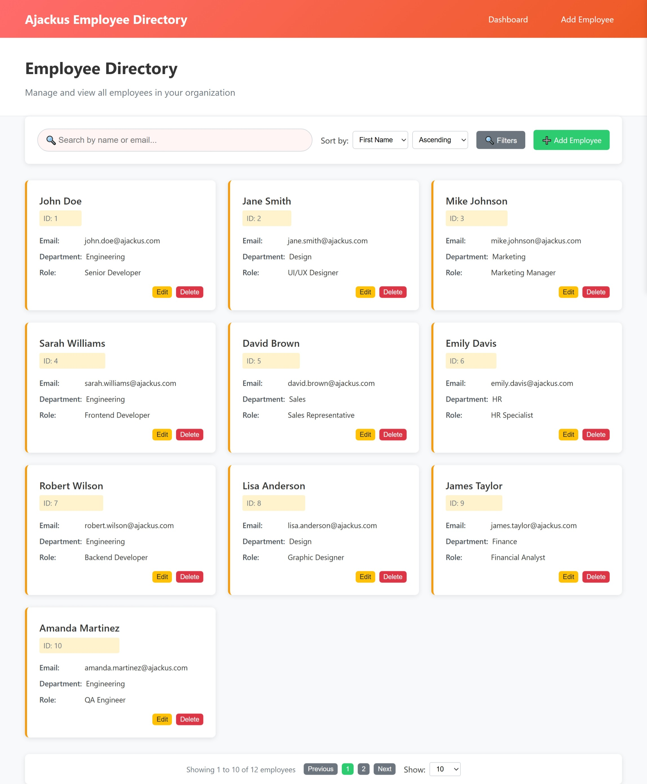
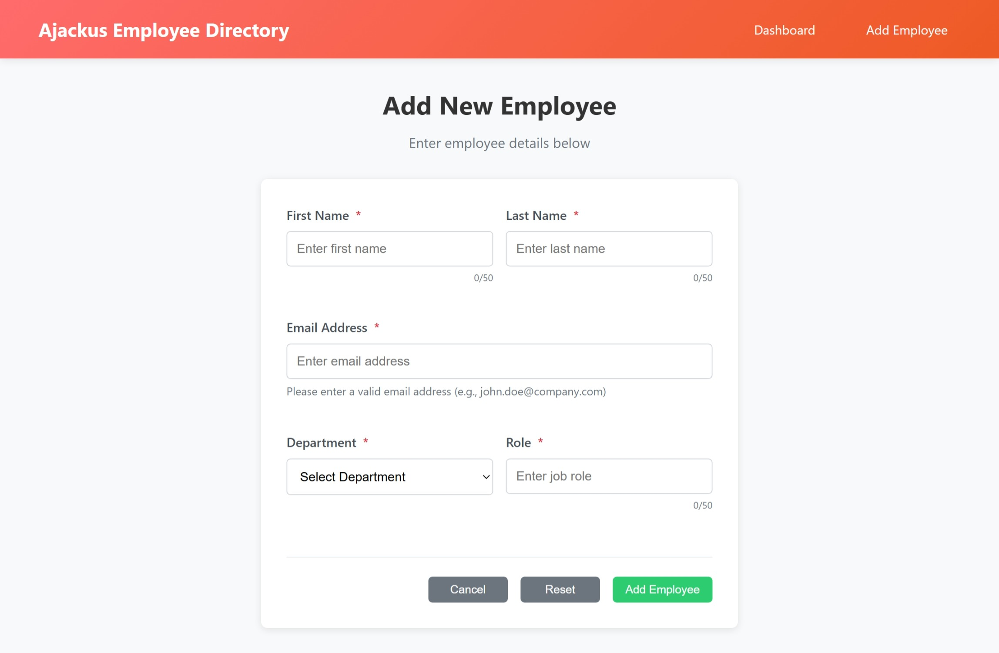

# 🏢 Ajackus Employee Directory Web App

A professional, responsive Employee Directory web application built with vanilla HTML, CSS, and JavaScript. This project demonstrates modern web development practices with a clean, modular architecture and comprehensive error handling.


## 📋 Table of Contents

- [Features](#-features)
- [Live Demo](#-live-demo)
- [Screenshots](#-screenshots)
- [Quick Start](#-quick-start)
- [Project Structure](#-project-structure)
- [Technologies Used](#-technologies-used)
- [Features in Detail](#-features-in-detail)
- [API Documentation](#-api-documentation)
- [Challenges & Solutions](#-challenges--solutions)
- [Future Improvements](#-future-improvements)
- [Contributing](#-contributing)
- [License](#-license)

## ✨ Features

### 🎯 Core Functionality
- **Employee Management**: Complete CRUD operations (Create, Read, Update, Delete)
- **Advanced Search**: Real-time search by name and email with debounced input
- **Smart Filtering**: Filter by department, role, and first name with sidebar interface
- **Flexible Sorting**: Sort by any field in ascending/descending order
- **Pagination**: Configurable page sizes (10, 25, 50, 100) with smart navigation
- **Responsive Design**: Mobile-first approach with tablet and desktop optimization

### 🎨 User Experience
- **Professional UI**: Clean, modern interface with warm color palette
- **Real-time Validation**: Instant form validation with helpful error messages
- **Loading States**: Visual feedback during data operations
- **Success/Error Messages**: Clear user feedback with auto-dismiss
- **Unsaved Changes Warning**: Prevents accidental data loss
- **Smooth Animations**: Transitions and hover effects for better UX

### 🛠️ Technical Features
- **Modular Architecture**: Separated concerns with dedicated CSS and JS files
- **Freemarker Templates**: Simulated backend integration with template rendering
- **In-Memory Data Management**: Complete CRUD operations without backend
- **Cross-Browser Compatibility**: Works on all modern browsers
- **Human-Readable Code**: Comprehensive comments explaining every logic step

## 🌐 Live Demo

**Try the application live:** [Employee Directory Demo](https://your-demo-link.com)

*Note: Replace with your actual demo link when deployed*

## 📸 Screenshots

### Dashboard View

*Main employee list with search, filter, and pagination controls*

### Add/Edit Form

*Professional form with real-time validation and character counters*

### Mobile Responsive

*Fully responsive design optimized for mobile devices*

### Filter Sidebar

*Advanced filtering interface with department and role selection*

*Note: Add actual screenshots to a `screenshots/` folder in your repository*

## 🚀 Quick Start

### Prerequisites
- Modern web browser (Chrome, Firefox, Safari, Edge)
- No additional dependencies required

### Installation

1. **Clone the repository**
   ```bash
   git clone https://github.com/yourusername/ajackus-employee-directory.git
   cd ajackus-employee-directory
   ```

2. **Open in browser**
   ```bash
   # Simply open index.html in your browser
   open index.html
   ```

### Alternative: Local Server (Recommended)

**Using Python:**
```bash
# Python 3
python -m http.server 8000

# Python 2
python -m SimpleHTTPServer 8000

# Then open: http://localhost:8000
```

**Using Node.js:**
```bash
# Install http-server globally
npm install -g http-server

# Start server
http-server

# Then open the displayed URL
```

**Using Live Server (VS Code Extension):**
1. Install "Live Server" extension
2. Right-click on `index.html`
3. Select "Open with Live Server"

## 📁 Project Structure

```
ajackus-employee-directory/
│
├── 📄 index.html                # Entry point (redirects to dashboard)
├── 📄 dashboard.html            # Main employee list page
├── 📄 form.html                 # Add/Edit employee form
│
├── 📁 js/
│   ├── 📄 data.js               # Mock data and data management class
│   ├── 📄 dashboard.js          # Dashboard functionality and controls
│   └── 📄 form.js               # Form validation and submission logic
│
├── 📁 css/
│   ├── 📄 style.css             # Global styles and utilities
│   ├── 📄 dashboard.css         # Dashboard-specific styles
│   └── 📄 form.css              # Form-specific styles
│
├── 📁 templates/
│   └── 📄 employee_list.ftl     # Freemarker template for employee rendering
│
├── 📁 assets/
│   ├── 📄 logo.png              # Application logo (placeholder)
│   └── 📁 icons/
│       └── 📄 README.md         # Icon assets documentation
│
├── 📁 screenshots/              # Application screenshots
│   ├── 📄 dashboard.png
│   ├── 📄 form.png
│   ├── 📄 mobile.png
│   └── 📄 filters.png
│
└── 📄 README.md                 # This file
```

## 🛠️ Technologies Used

| Technology | Purpose | Version |
|------------|---------|---------|
| **HTML5** | Semantic markup and structure | Latest |
| **CSS3** | Styling with Flexbox, Grid, animations | Latest |
| **Vanilla JavaScript** | ES6+ functionality and DOM manipulation | ES2020+ |
| **Freemarker Templates** | Simulated backend template rendering | Mock |
| **Responsive Design** | Mobile-first approach with media queries | - |

## 📱 Features in Detail

### Dashboard Page (`dashboard.html`)
- **Employee Grid**: Responsive card layout showing employee information
- **Search Bar**: Real-time search across names and emails with 300ms debounce
- **Advanced Filters**: Sidebar with department and role filtering
- **Sorting Controls**: Sort by any field in ascending/descending order
- **Pagination**: Navigate through large datasets efficiently
- **Action Buttons**: Edit and delete functionality for each employee

### Form Page (`form.html`)
- **Dual Mode**: Add new employees or edit existing ones
- **Real-time Validation**: Instant feedback on form fields
- **Character Counters**: Visual feedback for text field limits
- **Email Validation**: Proper email format checking with regex
- **Required Field Indicators**: Clear marking of mandatory fields
- **Form State Management**: Handles unsaved changes warnings

### Data Management
- **In-Memory Storage**: All data stored in JavaScript arrays
- **CRUD Operations**: Complete Create, Read, Update, Delete functionality
- **Search & Filter**: Advanced filtering with multiple criteria
- **Sorting**: Flexible sorting by any employee field
- **Pagination**: Efficient data pagination with configurable page sizes

## 🔧 API Documentation

### Data Manager Class

```javascript
// Get all employees
employeeDataManager.getAllEmployees()

// Get employee by ID
employeeDataManager.getEmployeeById(id)

// Add new employee
employeeDataManager.addEmployee(employeeData)

// Update employee
employeeDataManager.updateEmployee(id, employeeData)

// Delete employee
employeeDataManager.deleteEmployee(id)

// Search employees
employeeDataManager.searchEmployees(query)

// Filter employees
employeeDataManager.filterEmployees(filters)

// Sort employees
employeeDataManager.sortEmployees(employees, sortBy, sortOrder)
```

### Form Validation Rules

```javascript
{
    firstName: { required: true, minLength: 2, maxLength: 50 },
    lastName: { required: true, minLength: 2, maxLength: 50 },
    email: { required: true, pattern: /^[^\s@]+@[^\s@]+\.[^\s@]+$/ },
    department: { required: true, minLength: 2, maxLength: 50 },
    role: { required: true, minLength: 2, maxLength: 50 }
}
```

## 🎯 Challenges & Solutions

### 1. **Real-time Search Performance**
**Challenge**: Implementing search that doesn't lag as users type
**Solution**: Implemented debounced search with 300ms delay, preventing excessive function calls

### 2. **Form Validation UX**
**Challenge**: Creating validation that's helpful but not annoying
**Solution**: Real-time validation on blur, error clearing on input, and character counters for user guidance

### 3. **Responsive Design Complexity**
**Challenge**: Making the interface work well on all screen sizes
**Solution**: Mobile-first approach with CSS Grid and Flexbox, progressive enhancement for larger screens

### 4. **State Management**
**Challenge**: Managing complex state (filters, sorting, pagination) without frameworks
**Solution**: Created modular classes with clear separation of concerns and comprehensive state tracking

### 5. **Error Handling**
**Challenge**: Graceful handling of edge cases and user errors
**Solution**: Comprehensive validation, confirmation dialogs, and user-friendly error messages

### 6. **Code Maintainability**
**Challenge**: Writing clean, readable code without frameworks
**Solution**: Extensive commenting, modular architecture, and consistent naming conventions

## 🚀 Future Improvements

### Planned Features
- **Data Persistence**: Local storage or backend integration with real database
- **Advanced Search**: Full-text search with multiple criteria and filters
- **Export Functionality**: Export employee data to CSV, PDF, or Excel
- **Bulk Operations**: Select multiple employees for batch actions
- **Employee Photos**: Avatar upload and display functionality
- **Department Management**: Add/edit departments and roles dynamically
- **User Authentication**: Login system with role-based access control
- **Audit Trail**: Track changes and modifications to employee records

### Technical Enhancements
- **Performance Optimization**: Virtual scrolling for large datasets
- **Accessibility**: Enhanced ARIA labels and keyboard navigation
- **Progressive Web App**: Offline functionality and app-like experience
- **Unit Testing**: Comprehensive test coverage with Jest
- **Build Process**: Minification, bundling, and optimization for production
- **TypeScript**: Add type safety and better development experience
- **State Management**: Implement a lightweight state management solution

### UI/UX Improvements
- **Dark Mode**: Toggle between light and dark themes
- **Customizable Dashboard**: Drag-and-drop widgets and layouts
- **Advanced Filtering**: Date ranges, salary ranges, and custom filters
- **Data Visualization**: Charts and graphs for employee statistics
- **Keyboard Shortcuts**: Power user features for faster navigation
- **Multi-language Support**: Internationalization for global teams

## 🤝 Contributing

This is a demonstration project, but contributions are welcome:

1. Fork the repository
2. Create a feature branch (`git checkout -b feature/amazing-feature`)
3. Commit your changes (`git commit -m 'Add some amazing feature'`)
4. Push to the branch (`git push origin feature/amazing-feature`)
5. Open a Pull Request

### Development Guidelines
- Follow the existing code style and commenting patterns
- Add comprehensive comments explaining your logic
- Test on multiple browsers and devices
- Ensure responsive design works correctly
- Update documentation for any new features

## 📄 License

This project is created for educational and demonstration purposes as part of the Ajackus Frontend UI Assignment.

---

## 👨‍💻 Author

**Your Name** - [Your GitHub](https://github.com/yourusername)

Created as part of the **Ajackus Frontend UI Assignment**

---

## 🙏 Acknowledgments

- **Ajackus** for providing this challenging and educational assignment
- **Modern Web Standards** for making vanilla JavaScript powerful enough for complex applications
- **CSS Grid and Flexbox** for enabling responsive design without frameworks
- **Browser Developer Tools** for making debugging and development efficient

---

**Note**: This application is built using only vanilla web technologies as specified in the requirements. No frameworks, libraries, or external dependencies are used, demonstrating pure HTML, CSS, and JavaScript capabilities.

**⭐ If you found this project helpful, please give it a star!** 